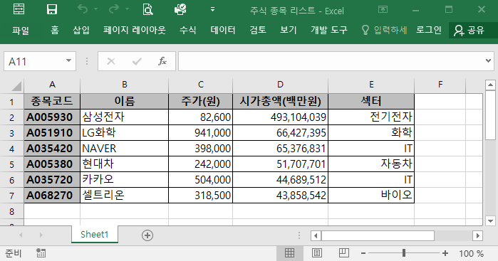
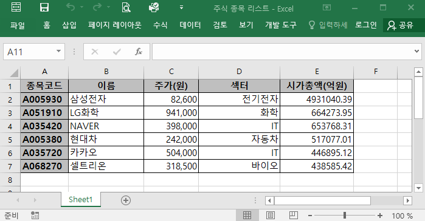

## 직장인 코딩의 걸림돌, 문서보안(DRM)

### 코딩 풋내기의 첫 번째 좌절 경험담 

파이썬을 활용해서 사내 데이터를 분석하기 위해서는 우선 엑셀 파일을 
파이썬 환경으로 불러오는 작업부터 시작해야 한다. 간단한 예로 판다스의
read_excel 함수를 사용해 다음과 같이 엑셀 파일을 불러와보자. 

<div class="prompt input_prompt">
In&nbsp;[1]:
</div>

```python
import pandas as pd
book = pd.read_excel('../assets/excel/주식 종목 리스트.xlsx')
```

<div class="prompt output_prompt">
Out&nbsp;[1]:
</div>


{:.output_traceback_line}

```
---------------------------------------------------------------------------
```

{:.output_traceback_line}

```
ValueError                                Traceback (most recent call last)
```

{:.output_traceback_line}

```
(중간 생략)
```

{:.output_traceback_line}

```
ValueError: File is not a recognized excel file
```


보시다시피 당황스러운 결과를 마주하게 된다. 판다스의 화려한(?) 문법들을 써먹어
볼 기회도 없이, 당최 알 수 없는 오류 메세지에 뒷골이 땡겨오기 시작한다.

이는 코딩을 처음 접했던 시기, 필자가 사내망에 파이썬을 설치한지 하루 만에 
겪게된 절망적인 상황이었다. 원인도 모른 채로 곧장 열심히 구글을 뒤져 
openpyxl 이라는 '엑셀 자동화' 라이브러리의 존재를 알게됐다. 기대를 안고
다음과 같이 엑셀파일을 여는 명령을 실행해보았다.

<div class="prompt input_prompt">
In&nbsp;[2]:
</div>

```python
import openpyxl as opx
book = opx.load_workbook(r'../assets/excel/주식 종목 리스트.xlsx')
```

<div class="prompt output_prompt">
Out&nbsp;[2]:
</div>


{:.output_traceback_line}

```
---------------------------------------------------------------------------
```

{:.output_traceback_line}

```
BadZipFile                                Traceback (most recent call last)
```

{:.output_traceback_line}

```
(중간 생략)

```

{:.output_traceback_line}

```
BadZipFile: File is not a zip file
```


이번에도 오류가 발생했다. 분명 개인 PC에서는 동일한 방법으로 문제없이 엑셀파일을 읽어올 수 있었다. 결국 한가지 차이점을 발견했다. 엑셀파일에 붙어있는 자물쇠가 문제였다.

||
|:---:|
|*이 자물쇠가 익숙하다면 잘 찾아오신겁니다*|

많은 회사들이 사내망에서 생산된 파일에 문서보안(DRM)을 적용한다. 보안이 걸린 파일을 탐색기에서 찾아보면 위와 같이 자물쇠가 달려있다. 사내 PC에 깔린 엑셀프로그램을 통해서만 해당 파일을 열 수 있도록 되어 있어, 파이썬의 접근이 막혀버린 것이다. 

### 파일 말고, 엑셀 그놈을 잡아라!

정녕 방법이 없단 말인가?  판다스나 openpyxl에서는 엑셀파일에 기록된 내용을 직접 긁어오는 방식을 쓰기 때문에 무조건 문서보안에 막힌다. 이 문제를 해결하려면 접근법을 달리 해야한다.

앞으로 소개할 xlwings 라는 파이썬 라이브러리는 액셀파일이 아니라 엑셀프로그램 자체를 직접 제어할 수 있다. 말하자면 파이썬 코드로 엑셀의 정신을 탈취하여 그의 육체를 지배하게 되는 것이다!

엑셀로 수행하는 데이터가공, 연산, 분석 등 대부분의 업무들은 판다스 라이브러리로 작업이 가능하다. 하지만 최종 결과물은 결국 회사에서 통용되는 엑셀 보고서 양식으로 만들어내야 한다. 고정된 양식에 주기적으로 반복되는 작업이라면 xlwings 라이브러리 활용도가 높아진다. 엑셀파일을 열어서 기초자료들을 데이터프레임 형태로 불러오고, 판다스로 작업한 결과들을 다시 정해진 엑셀 양식에 붙여넣는 작업을 자동화 할 수 있다. 작업 결과에 따라 보고서의 양식이 매번 바뀌어야 하는 경우에도, 일정한 규칙이 있다면 적절한 코딩을 통해 수작업을 최소화 할 수 있다.

## xlwings 맛보기

위에서 언급한 엑셀 자동화의 사례들을 맛보기로 미리 살펴보도록 하자. xlwings 라이브러리 역시 판다스와 마찬가지로 아나콘다(Anaconda)에 기본으로 포함돼있다. 임포트 할때는 보통 xw라는 별칭을 쓴다.

### 엑셀파일 열기

서두에서 사용했던 <주식 종목 리스트>(*[내려받기](/asset/excel/주식 종목 리스트.xlsx)*) 엑셀파일을 열어보자. 주피터 노트북에서 아래의 코드를 실행하면, 갑자기 엑셀프로그램이 알아서 켜지면서 해당 파일이 화면에 나타난다!

<div class="prompt input_prompt">
In&nbsp;[3]:
</div>

```python
import xlwings as xw
book = xw.Book('../assets/excel/주식 종목 리스트.xlsx')
```

||
|:---:|
|*윈도우 바탕화면 상에 엑셀 프로그램이 자동으로 켜진 모습*|

### 데이터프레임으로 읽어오기

엑셀파일 내의 표를 판다스 데이터프레임 형식으로 불러오자. 판다스의 read_excel 함수를 쓸 때와는 달리 전혀 오류가 나지 않는다!   
(물론 DRM이 안걸린 보통의 엑셀파일은 판다스로도 잘 열린다)

<div class="prompt input_prompt">
In&nbsp;[4]:
</div>

```python
import pandas as pd

df = book.sheets(1).used_range.options(pd.DataFrame).value
df
```

<div class="prompt output_prompt">
Out&nbsp;[4]:
</div>


<div markdown="0">
<div>
<style scoped>
    .dataframe tbody tr th:only-of-type {
        vertical-align: middle;
    }

    .dataframe tbody tr th {
        vertical-align: top;
    }

    .dataframe thead th {
        text-align: right;
    }
</style>
<table border="1" class="dataframe">
  <thead>
    <tr style="text-align: right;">
      <th></th>
      <th>이름</th>
      <th>주가(원)</th>
      <th>시가총액(백만원)</th>
      <th>섹터</th>
    </tr>
    <tr>
      <th>종목코드</th>
      <th></th>
      <th></th>
      <th></th>
      <th></th>
    </tr>
  </thead>
  <tbody>
    <tr>
      <th>A005930</th>
      <td>삼성전자</td>
      <td>82600.0</td>
      <td>493104039.0</td>
      <td>전기전자</td>
    </tr>
    <tr>
      <th>A051910</th>
      <td>LG화학</td>
      <td>941000.0</td>
      <td>66427395.0</td>
      <td>화학</td>
    </tr>
    <tr>
      <th>A035420</th>
      <td>NAVER</td>
      <td>398000.0</td>
      <td>65376831.0</td>
      <td>IT</td>
    </tr>
    <tr>
      <th>A005380</th>
      <td>현대차</td>
      <td>242000.0</td>
      <td>51707701.0</td>
      <td>자동차</td>
    </tr>
    <tr>
      <th>A035720</th>
      <td>카카오</td>
      <td>504000.0</td>
      <td>44689512.0</td>
      <td>IT</td>
    </tr>
    <tr>
      <th>A068270</th>
      <td>셀트리온</td>
      <td>318500.0</td>
      <td>43858542.0</td>
      <td>바이오</td>
    </tr>
  </tbody>
</table>
</div>
</div>


### 가공된 자료를 엑셀파일에 붙여넣기

판다스 명령어를 활용해 시가총액의 단위를 백만원에서 억원으로 바꾼 후, 엑셀파일에 그대로 붙여넣어보자. 실행되고 있는 엑셀프로그램 상의 표가 바뀐 것을 확인할 수 있다

<div class="prompt input_prompt">
In&nbsp;[5]:
</div>

```python
df['시가총액(억원)'] = df['시가총액(백만원)'] /100
df = df.drop('시가총액(백만원)',axis=1)
df
```

<div class="prompt output_prompt">
Out&nbsp;[5]:
</div>


<div markdown="0">
<div>
<style scoped>
    .dataframe tbody tr th:only-of-type {
        vertical-align: middle;
    }

    .dataframe tbody tr th {
        vertical-align: top;
    }

    .dataframe thead th {
        text-align: right;
    }
</style>
<table border="1" class="dataframe">
  <thead>
    <tr style="text-align: right;">
      <th></th>
      <th>이름</th>
      <th>주가(원)</th>
      <th>섹터</th>
      <th>시가총액(억원)</th>
    </tr>
    <tr>
      <th>종목코드</th>
      <th></th>
      <th></th>
      <th></th>
      <th></th>
    </tr>
  </thead>
  <tbody>
    <tr>
      <th>A005930</th>
      <td>삼성전자</td>
      <td>82600.0</td>
      <td>전기전자</td>
      <td>4931040.39</td>
    </tr>
    <tr>
      <th>A051910</th>
      <td>LG화학</td>
      <td>941000.0</td>
      <td>화학</td>
      <td>664273.95</td>
    </tr>
    <tr>
      <th>A035420</th>
      <td>NAVER</td>
      <td>398000.0</td>
      <td>IT</td>
      <td>653768.31</td>
    </tr>
    <tr>
      <th>A005380</th>
      <td>현대차</td>
      <td>242000.0</td>
      <td>자동차</td>
      <td>517077.01</td>
    </tr>
    <tr>
      <th>A035720</th>
      <td>카카오</td>
      <td>504000.0</td>
      <td>IT</td>
      <td>446895.12</td>
    </tr>
    <tr>
      <th>A068270</th>
      <td>셀트리온</td>
      <td>318500.0</td>
      <td>바이오</td>
      <td>438585.42</td>
    </tr>
  </tbody>
</table>
</div>
</div>


<div class="prompt input_prompt">
In&nbsp;[6]:
</div>

```python
book.sheets(1)['A1'].value = df
```

||
|:---:|
|*활성화되어 있는 엑셀 파일이 자동으로 바뀌었다*|
